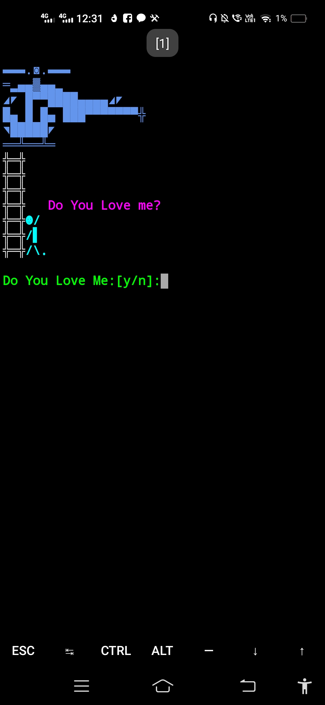

<h1>Propose</h1>
<h3>This webpage is made for prank. you can use &nbsp;git clone https://github.com/kdo2064/propose link to visit to site but don't copy the code. scolding in hind (Agar koi madhochod mera code copy kare ga ushaka ma ch****. so please don't copy my code and deign otherwise you are run** ke beta/beti.</h3>

<h2>About Developer</h2>
<h3>Hello, I am KDO, member of Cyber-D team. I am a programmer, Developer, Hacker, Rapper and as well as Student. I know 7-8 coding languages.</h3> 

<h2>About Cyber-D</h2>
<h3>Cyber-D is a Team of Hacker or IT Student. There are nearly 35 member. People this Hacking is a Crime so Our main aim is to promate hacking and give the society a Digital Army.  Some memeber name are listed below:</h3>
<ol>
<li>Anand</li>
<li>DRJ</li>
<li>Vivek</li>
<li>RY</li>
<li>DK</li>
<li>Shivam</li>
<li>Vicky</li>
<li>Zerox</li>
<li>Arpan</li>
<li>Hawk</li>
<li>Dev....</li>
<li>Krishna<li>
</ol>

<h2>-->command<--</h2>
<h3>termux</h3>

->pkg update && pkg upgrade  
->pkg install git 
->pkg install python3 
->git clone https://github.com/kdo2064/propose 
->cd propose 
->python3 main.py 

<h3>Linux</h3>

->sudo apt update && pkg upgrade  
->sudo apt install git 
->sudo apt install python3 
->git clone https://github.com/kdo2064/propose 
->cd propose 
->python3 main.py 
